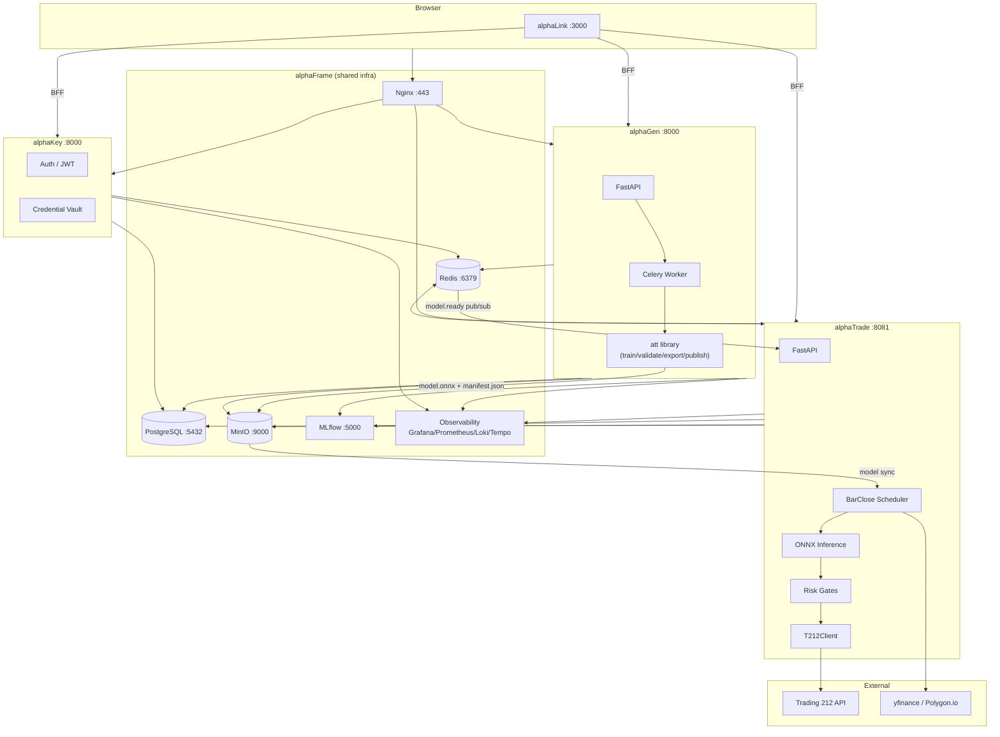
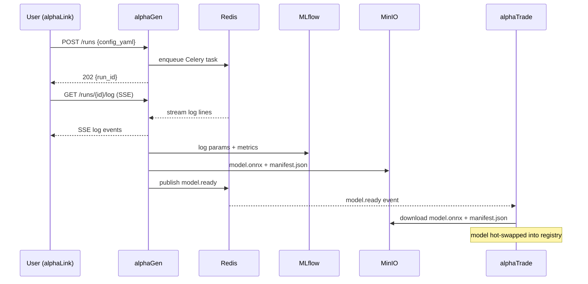
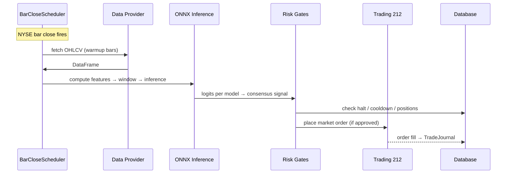

# projectAlpha Documentation Vault

> projectAlpha canonical reference documentation.  
> **For best usage, open as an Obsidian vault**: `File → Open Folder as Vault → alphaDocs/`

---

# Platform Overview

[[README]] · [[platform/Features]] · [[platform/Tech-Stack]] · [[platform/Key-Decisions]]

> projectAlpha is an automated algorithmic trading platform — ML models trained on price data are validated, published, and executed live against Trading 212.

| | |
|---|---|
| **Goal** | Automated ML-driven trading across multiple instruments |
| **Architecture** | Microservices — each service is an independent repo |
| **Communication** | REST · SSE · Redis pub/sub · Celery task queue |
| **Infra host** | [[alphaFrame\|alphaFrame]] (Docker Compose) |

→ [[platform/Overview]] for the full system map + global Mermaid diagram.

---

## Platform-Wide Docs

| Page | Contents |
|---|---|
| [[platform/Overview]] | System map, global data flow, Mermaid architecture diagram |
| [[platform/Features]] | All platform features grouped by domain |
| [[platform/Tech-Stack]] | Full tech stack per service + shared infra |
| [[platform/Key-Decisions]] | Architecture decision records (comms, security, scaling, observability) |

---

## Services

| Service  | Purpose | Port |
|---|---|---|
| alphaFrame | Infrastructure — MinIO, MLflow, Redis, Postgres, Nginx, OTel | multiple |
| alphaGen | ML model generation — train, validate, backtest, publish | 8000 |
| alphaTrade  | Trading executor — broker, risk, scheduler, consensus | 8001 |
| alphaLink| Frontend UI — Next.js + BFF proxy | 3000 |
| alphaKey | Auth & account management | 8000 |
| alphaTest| Regression testing suite | TBD |
| alphaPerf | Performance testing suite | TBD |

---

## System Architecture



---

## Primary Data Flows

### 1. Model Training → Publishing



### 2. Live Trading Tick



---

## Communication Patterns

| Pattern | Used between | Purpose |
|---|---|---|
| REST (HTTP/JSON) | alphaLink ↔ alphaGen, alphaTrade, alphaKey | Synchronous operations |
| SSE (Server-Sent Events) | alphaGen → alphaLink (logs + model.ready) | Real-time streaming |
| SSE | alphaTrade → alphaLink (tick events, fills) | Live dashboard |
| Redis pub/sub | alphaGen worker → alphaTrade | model.ready notification |
| Celery (Redis broker) | alphaGen API → Celery worker | Async training job dispatch |
| S3 API (MinIO) | alphaGen write, alphaTrade read | Model artifact transfer |
| MLflow SDK | alphaGen write, alphaTrade read | Model registry |
| OTLP gRPC | All services → OTel Collector | Distributed traces + metrics |

See [[platform/Key-Decisions]] for why these patterns were chosen.


---
## Deployment

1. Download all repos to parent directory.
2. From service alphaFrame, run ```docker compose --build```

---

## ToDo

Not-yet-done cross-service work and long-term tasks. See [[ToDo]].

| Page | Contents |
|---|---|
| [[ToDo/Cross-Service-Backlog]] | Open cross-service obligations + known unfixed races/bugs |
| [[ToDo/Compliance]] | Open compliance items (T212 ToS, FCA perimeter, GDPR, production secrets) |

---

## Templates

| Template | Use |
|---|---|
| [[_templates/service-template]] | Hub note for a new service |
| [[_templates/Architecture-template]] | Architecture sub-page |
| [[_templates/Interactions-template]] | Interactions sub-page |
| [[_templates/API-template]] | API sub-page |
| [[_templates/Data-template]] | Data sub-page |
| [[_templates/Config-template]] | Config sub-page |

> [!tip] Adding a new service
> 1. Create `services/<ServiceName>/` folder
> 2. Copy each template; replace `{{placeholders}}`
> 3. Add entry to this README table
> 4. Add node to [[platform/Overview]] Mermaid diagram
> 5. Update [[reference/Ports-and-Endpoints]] and [[platform/Tech-Stack]]

---

## Update Policy

These docs are **living documentation** — update them when:
- New API endpoint added/removed
- New env var added
- DB schema changed (migration added)
- New service dependency wired
- Override chain / config logic changes
- New service spun up

*Last reviewed: 2026-06-06*


## Reference

| Page | Contents |
|---|---|
| [[reference/Glossary]] | Domain terms: run, manifest, gate, OCO, consensus, etc. |
| [[reference/Ports-and-Endpoints]] | Port map for all services and infrastructure |
| [[reference/Event-Channels]] | Redis pub/sub + SSE channels and their consumers |


## Contributing
If you'd like to contribute changes to the docs, open a PR against the `main` branch. Keep docs in Markdown and follow existing templates in `_templates/`.

## Notes about Obsidian
This repository also stores an Obsidian vault. The vault-friendly README is preserved as `README.obsidian.md` for local editing (backlinks, transclusions). `README.md` is intended for GitHub rendering.

## License
See the LICENSE file in the repository root if present. (Currently in ToDo)
