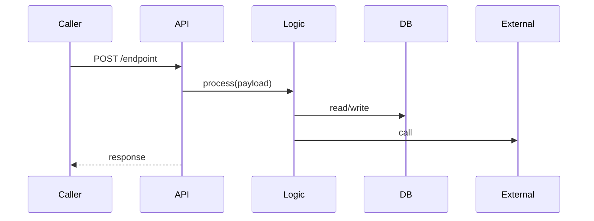
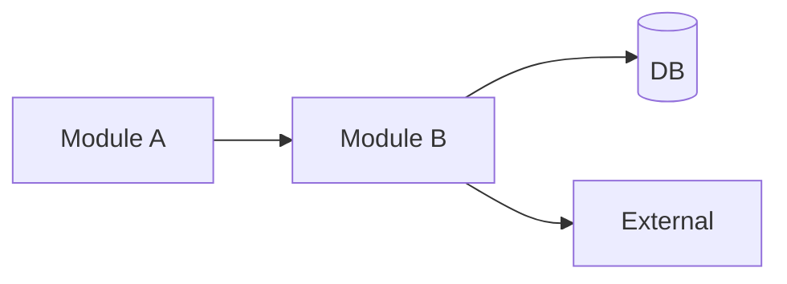

# {{SERVICE_NAME}} — Architecture

[[{{SERVICE_NAME}}]] · [[alphaDocs/services/alphaKey/Interactions]] · [[alphaDocs/services/alphaKey/API]] · [[alphaDocs/services/alphaKey/Data]] · [[alphaDocs/services/alphaKey/Config]]

---

## Purpose

> Brief statement: what problem this service solves in the platform.

---

## Internal Modules

| Module / Package | Path | Responsibility |
|---|---|---|
| `api` | `{{src}}/api/` | FastAPI app, routers, dependency injection |
| `store` | `{{src}}/store/` | DB models, repos, migrations |
| `…` | `…` | … |

---

## Primary Flow — Sequence

---

## Component Interaction

---

## Key Design Decisions

- Decision 1 — reason
- Decision 2 — reason

---

*See [[platform/Key-Decisions]] for platform-wide ADRs.*
