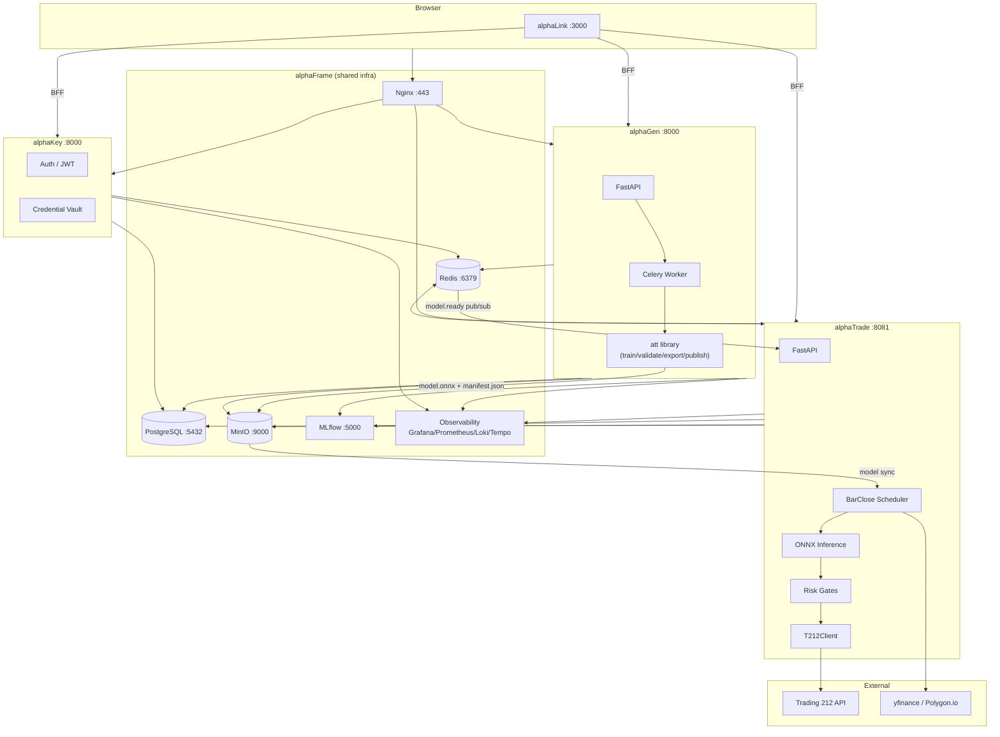
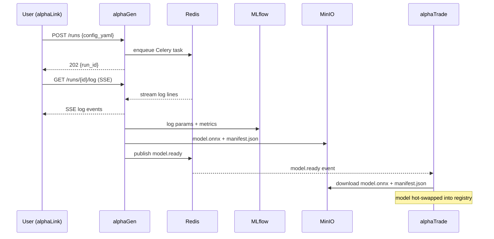
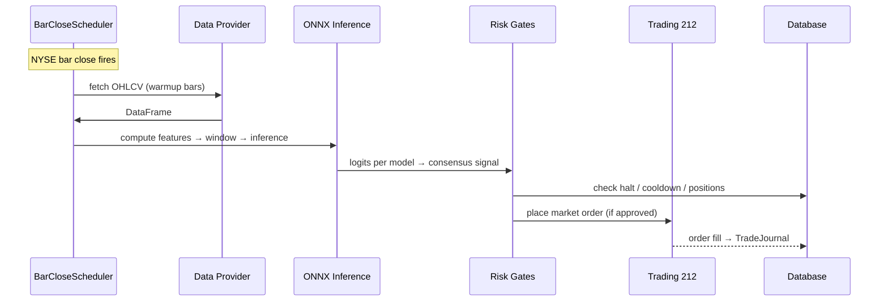

# Platform Overview

[[README]] · [[platform/Features]] · [[platform/Tech-Stack]] · [[platform/Key-Decisions]]

> projectAlpha is an automated algorithmic trading platform — ML models trained on price data are validated, published, and executed live against Trading 212.

---

## System Architecture

---

## Services

| Service | Status | Role | Port |
|---|---|---|---|
| [[services/alphaFrame/alphaFrame\|alphaFrame]] | 🟢 Full | Shared infrastructure — Postgres, Redis, MinIO, MLflow, Nginx, Observability | multiple |
| [[services/alphaGen/alphaGen\|alphaGen]] | 🟢 Full | ML model generation — train, validate, backtest, publish | 8000 |
| [[services/alphaTrade/alphaTrade\|alphaTrade]] | 🟢 Full | Trading executor — scheduler, inference, risk, orders | 8081/8080/9090 |
| [[services/alphaLink/alphaLink\|alphaLink]] | 🟢 Full | Frontend + BFF — Next.js UI + proxy | 3000 |
| [[services/alphaKey/alphaKey\|alphaKey]] | 🟡 Partial | Auth + credential vault — JWT, Argon2, Fernet | 8000 |
| [[services/alphaTest/alphaTest\|alphaTest]] | ⬜ Planned | Regression testing | TBD |
| [[services/alphaPerf/alphaPerf\|alphaPerf]] | ⬜ Planned | Performance testing | TBD |

---

## Primary Data Flows

### 1. Model Training → Publishing

### 2. Live Trading Tick

---

## Communication Patterns

| Pattern | Used between | Purpose |
|---|---|---|
| REST (HTTP/JSON) | alphaLink ↔ alphaGen, alphaTrade, alphaKey | Synchronous operations |
| SSE (Server-Sent Events) | alphaGen → alphaLink (logs + model.ready) | Real-time streaming |
| SSE | alphaTrade → alphaLink (tick events, fills) | Live dashboard |
| Redis pub/sub | alphaGen worker → alphaTrade | model.ready notification |
| Celery (Redis broker) | alphaGen API → Celery worker | Async training job dispatch |
| S3 API (MinIO) | alphaGen write, alphaTrade read | Model artifact transfer |
| MLflow SDK | alphaGen write, alphaTrade read | Model registry |
| OTLP gRPC | All services → OTel Collector | Distributed traces + metrics |

See [[platform/Key-Decisions]] for why these patterns were chosen.

---

## Deployment

All services run as Docker containers on a single host via Docker Compose. The `platform` named bridge network provides service discovery by container name (e.g. `postgres`, `redis`, `alphagen-api`).

**Start order:** alphaFrame infra first → alphaKey → alphaGen + alphaTrade + alphaLink (depend on infra being healthy).

**Local URLs:**
- UI: `http://localhost:3000`
- Grafana: `http://localhost:3001`
- MLflow: `http://localhost:5000`
- MinIO Console: `http://localhost:9001`
