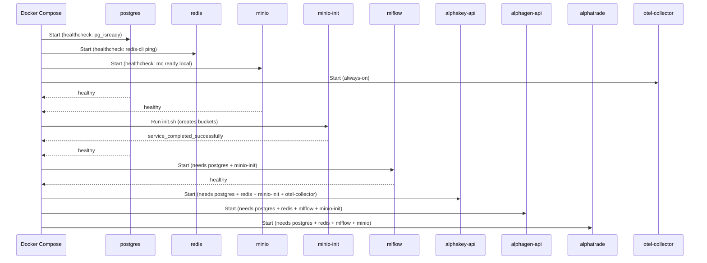
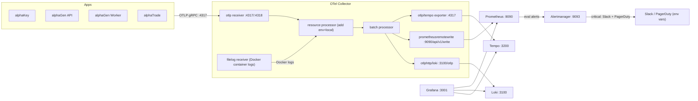

# alphaFrame — Architecture

[[alphaFrame|alphaFrame]] · [[alphaDocs/services/alphaFrame/Interactions|Interactions]] · [[alphaDocs/services/alphaFrame/API|API]] · [[alphaDocs/services/alphaFrame/Data|Data]] · [[alphaDocs/services/alphaFrame/Config|Config]]

---

## Purpose

alphaFrame eliminates per-project infrastructure duplication. Previously alphaGen and alphaTrade each ran their own Postgres/Redis/MinIO — causing port conflicts and model artifacts not being visible cross-project. alphaFrame provides one shared `platform` Docker network with all stateful services, one MLflow instance for experiment tracking, and a full LGTM observability stack.

---

## Service Groups

### Core Stateful Infrastructure

| Container | Image | Purpose |
|---|---|---|
| `postgres` | `postgres:16-alpine` | Primary SQL store for all services |
| `redis` | `redis:7-alpine` | Celery broker/results, pub/sub, token denylist — auth required, AOF persistence |
| `minio` | `minio/minio` | S3-compatible object store for model artifacts |
| `minio-init` | `minio/mc` | One-shot: creates buckets + per-service scoped users (alphagen/alphatrade/mlflow) |
| `mlflow` | custom (`mlflow:v3.13.0` + psycopg2 + boto3) | Experiment tracking + model registry |
| `postgres-backup` | `postgres:16-alpine` | Daily pg_dump of all databases → `postgres_backups` volume (7-day retention) |
| `nginx` | custom (nginx:alpine + self-signed TLS) | TLS termination + rate-limited reverse proxy |

### Application Services (joined to platform network)

| Container | Source | Purpose |
|---|---|---|
| `alphakey-api` | `../alphaKey` | Auth / vault service |
| `alphagen-api` | `../alphaGen` | Training API (runs Alembic upgrade at startup) |
| `alphagen-worker` | `../alphaGen` | Celery worker (concurrency=1) — capped at 2 CPU / 4G RAM |
| `alphagen-beat` | `../alphaGen` | Celery Beat scheduler — runs `att.check_drift_and_retrain` daily; capped at 0.5 CPU / 512M |
| `alphagen-flower` | `mher/flower` | Celery monitoring UI |
| `alphatrade` | `../alphaTrade` | Trading executor — reserved 0.5 CPU / 512M, max 2 CPU / 2G |
| `alphalink` | `../alphaLink` | Next.js frontend — internal only, nginx is sole ingress |

### Observability Stack (LGTM)

| Container | Image | Purpose |
|---|---|---|
| `otel-collector` | otel/opentelemetry-collector-contrib:0.103.0 | Receives OTLP traces/metrics/logs from apps; routes to backends |
| `prometheus` | prom/prometheus:v2.52.0 | Metrics storage (15d), alert evaluation |
| `loki` | grafana/loki:3.1.0 | Log aggregation (7d) |
| `tempo` | grafana/tempo:2.5.0 | Trace storage (7d), service graph |
| `alertmanager` | prom/alertmanager:v0.27.0 | Alert routing — null default receiver; critical route (30s) → Slack + PagerDuty via env vars |
| `grafana` | grafana/grafana:11.1.0 | Unified UI for all telemetry |
| `node-exporter` | prom/node-exporter:v1.8.1 | Host CPU/memory/disk metrics |
| `cadvisor` | gcr.io/cadvisor/cadvisor:v0.49.1 | Per-container resource metrics |
| `postgres-exporter` | prometheuscommunity/postgres-exporter | PostgreSQL metrics |
| `redis-exporter` | oliver006/redis_exporter | Redis metrics |

---

## Startup Sequence

---

## Observability Pipeline

---

## Nginx Reverse Proxy Architecture

All external traffic enters via Nginx on ports 80/443. Port 80 redirects to HTTPS.

| Route | Upstream | SSE-safe? | Rate-limited? |
|---|---|---|---|
| `/auth/internal/` | — | — | `return 404` — blocked at nginx |
| `/auth/` | `alphakey-api:8000/auth/` | No | Yes |
| `/alphagen/runs/<id>/(events\|log)` | `alphagen-api:8000` | ✅ (proxy_buffering off, 3600s) | No |
| `/alphagen/runs/events` | `alphagen-api:8000/runs/events` | ✅ (proxy_buffering off, 3600s) | No |
| `/alphagen/` | `alphagen-api:8000/` | No | Yes |
| `/stream` | `alphatrade:8081/stream` | ✅ (proxy_buffering off, 3600s) | No |
| `/` (default) | `alphalink:3000` | No | Yes |

> [!note] Internal-only endpoints
> `/auth/internal/*` returns 404 at nginx — never proxied. alphaLink has no host port; nginx is the only path to the UI.

---

## Key Design Decisions

- **Named `platform` network**: All services join `platform` bridge; app projects declare `networks: { platform: { external: true } }` — service names resolve as DNS hostnames.
- **Single Postgres instance, per-project databases**: One `platform` user owns `alphagen`, `alphatrade`, `mlflow`, `alphakey` databases — isolation without separate instances.
- **MLflow with no artifact serving** (`--no-serve-artifacts`): Clients fetch model files directly from MinIO S3 — reduces MLflow load, preserves MinIO as artifact source of truth.
- **OTel Collector pattern**: Single collector aggregates all telemetry; only exporter config changes for cloud migration (Grafana Cloud, Datadog, etc.) — zero app instrumentation changes needed.
- **Exemplars end-to-end**: `TraceBasedExemplarFilter` in apps → OTel Collector preserves exemplar metadata → Prometheus → Grafana links metric data points to traces.

---

*See [[platform/Key-Decisions]] for full ADRs on shared infra and observability.*
