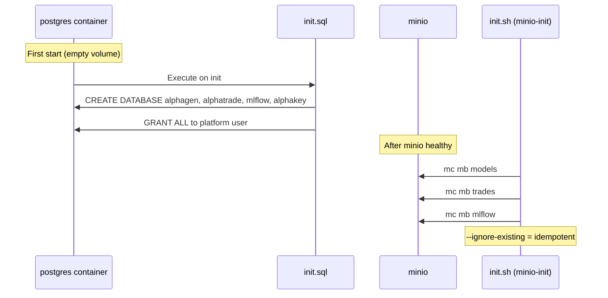

# alphaFrame — Data

[[services/alphaFrame/alphaFrame|alphaFrame]] · [[services/alphaFrame/Architecture|Architecture]] · [[services/alphaFrame/Interactions|Interactions]] · [[services/alphaFrame/API|API]] · [[services/alphaFrame/Config|Config]]

---

## PostgreSQL

Single PostgreSQL 16 instance. One user (`platform`) owns all databases.

**Init script:** `init/postgres/init.sql` — runs once on first container start (empty volume).

### Databases

| Database | Owner | Used by | Managed by |
|---|---|---|---|
| `alphagen` | `platform` | [[services/alphaGen/alphaGen\|alphaGen]] | Alembic (alphagen-api on startup) |
| `alphatrade` | `platform` | [[services/alphaTrade/alphaTrade\|alphaTrade]] | Alembic (alphatrade on startup) |
| `mlflow` | `platform` | MLflow server | MLflow internal migrations |
| `alphakey` | `platform` | [[services/alphaKey/alphaKey\|alphaKey]] | Alembic (alphakey-api on startup) |

For tables within each database see the owning service's Data page:
- [[services/alphaGen/Data]] — `runs`, `validation_settings`
- [[services/alphaTrade/Data]] — 23 tables covering positions, orders, signals, backtests, bot config
- [[services/alphaKey/Data]] — `user`, `refresh_token`, `signing_key`, `credential`, `audit_log`, `credential_access_audit`

---

## MinIO (Object Store)

Single MinIO instance on port 9000. Console on 9001.

**Init script:** `init/minio/init.sh` — runs via `minio-init` one-shot container after MinIO is healthy.

### Buckets

| Bucket | Contents | Written by | Read by |
|---|---|---|---|
| `models` | `model.onnx`, `manifest.json`, `backtest.json` per version | [[services/alphaGen/alphaGen\|alphaGen]] publish endpoint | [[services/alphaTrade/alphaTrade\|alphaTrade]] ModelSyncDaemon |
| `trades` | Trade logs, reports | [[services/alphaTrade/alphaTrade\|alphaTrade]] | Manual / future reporting |
| `mlflow` | MLflow registered model versions (artifacts) | MLflow server (via alphaGen) | MLflow, [[services/alphaTrade/alphaTrade\|alphaTrade]] |

**Path structure (models bucket):** `{user}/{account}/{run_name}/{version}/` — e.g. `prod/isa/aapl_daily_mlp/v3/model.onnx`  
**Latest pointer:** `{user}/{account}/{run_name}/latest` — JSON with `{version, uploaded_at, run_name}` for polling

---

## Redis

Single Redis 7 instance on port 6379. No persistence (in-memory only — restart clears all keys).

### Key Space / Database Allocation

| Redis DB | Used by | Purpose |
|---|---|---|
| `db 0` | [[services/alphaGen/alphaGen\|alphaGen]] Celery broker | Task routing |
| `db 0` | [[services/alphaKey/alphaKey\|alphaKey]] | Token denylist (JTI → expiry), session data |
| `db 1` | [[services/alphaGen/alphaGen\|alphaGen]] Celery results | Task state + return values |

### Pub/Sub Channels (db 0)

See [[reference/Event-Channels]] for full channel documentation.

| Channel | Producer | Consumer |
|---|---|---|
| `run:{id}:log` | alphaGen Celery worker | alphaGen API SSE endpoint |
| `model.ready` | alphaGen publish endpoint | alphaTrade (and alphaGen SSE /runs/events) |

---

## MLflow Metadata Store

MLflow uses its own schema in `mlflow` Postgres database:
- Experiments, runs, params, metrics, tags
- Registered models, model versions, aliases
- Trace metadata

alphaGen writes to it via `mlflow-skinny` SDK. alphaTrade reads via `mlflow-skinny` SDK.

---

## Observability Data Stores

| Store | Container | Location | Retention |
|---|---|---|---|
| Prometheus metrics | `prometheus_data` volume | `/prometheus` | 15 days |
| Loki logs | `loki_data` volume | `/loki/chunks` | 7 days |
| Tempo traces | `tempo_data` volume | `/var/tempo` | 7 days |
| Grafana dashboards/config | `grafana_data` volume | Persistent | Indefinite |
| Alertmanager state | `alertmanager_data` volume | Persistent | Indefinite |

---

## Data Flows (Init)

