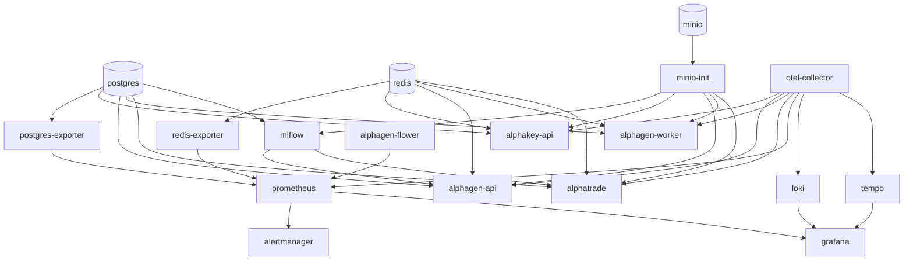

# alphaFrame — Interactions

[[alphaFrame|alphaFrame]] · [[alphaDocs/services/alphaFrame/Architecture|Architecture]] · [[alphaDocs/services/alphaFrame/API|API]] · [[alphaDocs/services/alphaFrame/Data|Data]] · [[alphaDocs/services/alphaFrame/Config|Config]]

---

## Inputs

alphaFrame is **pure infrastructure** — it receives no application-layer requests. All inputs are Docker-level.

| Source | Mechanism | Purpose |
|---|---|---|
| `docker compose up` operator | Docker Compose CLI | Start entire stack |
| `scripts/reset-dev.sh` | Bash → Docker exec | Truncate all data (schema preserved) |
| `scripts/clear-models.sh` | Bash → Docker exec | Clear model artifacts + deployment records |
| App services (alphaKey, alphaGen, alphaTrade) | TCP connections | Connect to Postgres, Redis, MinIO, MLflow |
| App services | OTLP gRPC :4317 | Send traces, metrics, logs to OTel Collector |
| Prometheus | HTTP pull | Scrape metrics from exporters + app `/metrics` endpoints |
| Browser / alphaLink | HTTP :80/:443 | Nginx proxy for all app services |

---

## Outputs

| Destination | Mechanism | Format | What |
|---|---|---|---|
| [[alphaKey\|alphaKey]] | TCP :5432 | SQL | `alphakey` database queries |
| [[alphaGen\|alphaGen]] API + Worker | TCP :5432 | SQL | `alphagen` database queries |
| [[alphaTrade\|alphaTrade]] | TCP :5432 | SQL | `alphatrade` database queries |
| MLflow server | TCP :5432 | SQL | `mlflow` database queries |
| All app services | TCP :6379 | Redis protocol | Pub/sub, Celery broker, token denylist |
| [[alphaGen\|alphaGen]], [[alphaTrade\|alphaTrade]] | HTTP :9000 | S3 API | Model artifacts (models bucket), trade logs (trades bucket), MLflow artifacts (mlflow bucket) — each service uses a scoped MinIO account |
| `postgres-backup` | pg_dump → volume | Compressed SQL | Daily backup of all databases to `postgres_backups` volume; 7-day retention |
| All app services | HTTP :5000 | REST | MLflow experiment tracking + model registry API |
| [[alphaLink\|alphaLink]] | HTTP/HTTPS | Proxied REST + SSE | Nginx forwards to app services |
| Grafana | HTTP | Dashboard queries | Prometheus metrics, Loki logs, Tempo traces |
| Alertmanager | HTTP | Alert delivery | `severity=critical` → Slack + PagerDuty (env vars); non-critical silently dropped |

---

## Service Dependency Map

---

## Data Reset — What Gets Cleared

**`scripts/reset-dev.sh`** (requires typing "RESET" then "YES"):
- TRUNCATE CASCADE: all user tables in `alphagen` and `alphatrade` DBs (preserves `alembic_version`)
- DELETE: all MLflow runs, experiments (keeps experiment id=0), model versions
- `mc rm --recursive`: all objects in `models`, `trades`, `mlflow` MinIO buckets
- `redis-cli FLUSHALL`
- Clear alphaTrade local model cache (`/app/models/*`)
- Does NOT touch: bucket structure, DB schemas, migration state

**`scripts/clear-models.sh`**:
- MinIO `models` + `mlflow` buckets cleared
- MLflow DB: runs, registered models, model versions, traces
- alphaTrade DB: backtesttrade, backtestmodelrun, backtestrun, model_deployments, model_override, modelperformance, signal
- Local alphaTrade model cache

---

## No Application Outputs

alphaFrame does not produce business data — it stores, forwards, and observes data created by application services. No events, no REST responses to upstream callers.
