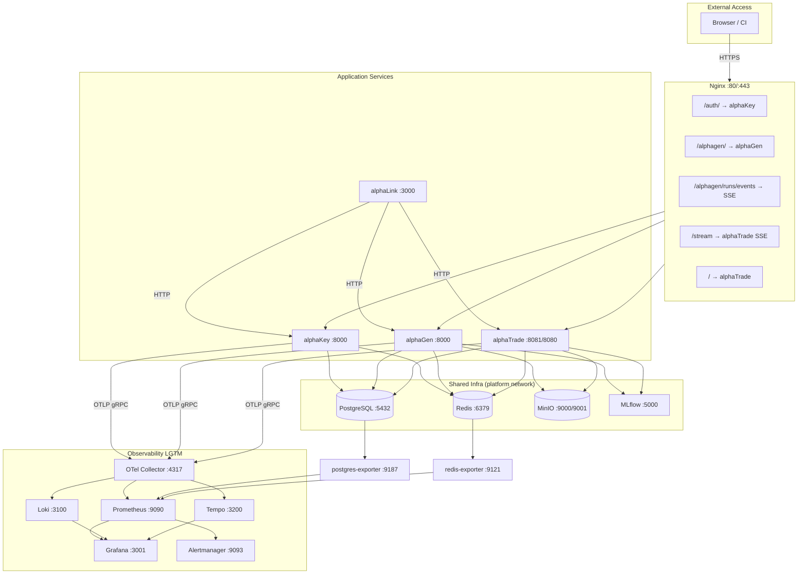

# alphaFrame

> Shared infrastructure layer — runs all stateful services and observability stack that every other platform service depends on.

**Status:** 🟢 Full  
**Repo path:** `projectAlpha/alphaFrame/`  
**No application port** — pure infrastructure; exposed via individual service ports.

---

## Contents

| Page | Description |
|---|---|
| [[services/alphaFrame/Architecture\|Architecture]] | Docker services, init flow, observability pipeline |
| [[services/alphaFrame/Interactions\|Interactions]] | Inputs, outputs, service connectivity map |
| [[services/alphaFrame/API\|API]] | No inbound API — port map and Nginx routes |
| [[services/alphaFrame/Data\|Data]] | PostgreSQL databases, MinIO buckets, Redis key spaces |
| [[services/alphaFrame/Config\|Config]] | All env vars, docker-compose wiring, Nginx config |

---

## Mermaid Flow

---

## Related

- [[platform/Overview]] — system-wide context
- [[reference/Ports-and-Endpoints]] — full port map
- [[reference/Event-Channels]] — Redis pub/sub channels
- [[platform/Key-Decisions]] — why shared infra / LGTM stack chosen
