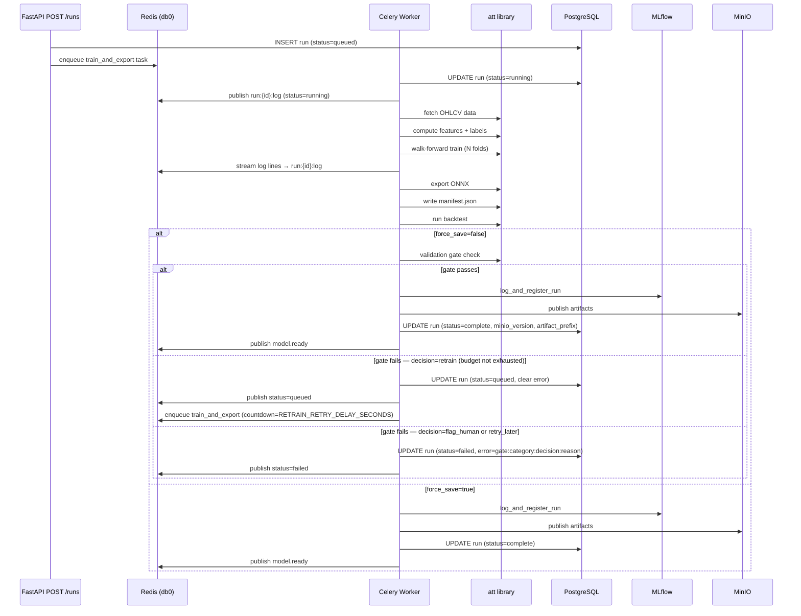
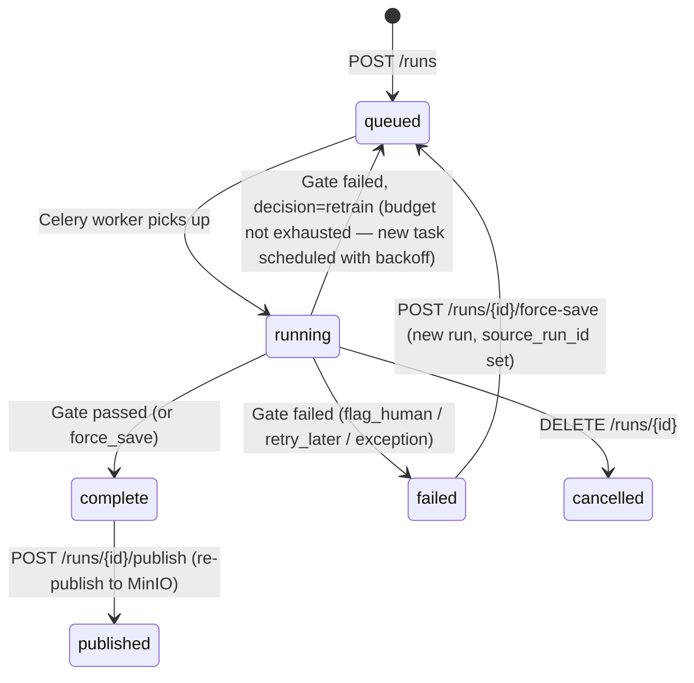

# alphaGen — Architecture

[[services/alphaGen/alphaGen|alphaGen]] · [[services/alphaGen/Interactions|Interactions]] · [[services/alphaGen/API|API]] · [[services/alphaGen/Data|Data]] · [[services/alphaGen/Config|Config]]

---

## Purpose

alphaGen trains multi-class (BUY/SELL/HOLD) classifiers on OHLCV price data, validates their quality through a configurable gate, runs walk-forward backtests, exports to ONNX, and publishes to MinIO so [[services/alphaTrade/alphaTrade|alphaTrade]] can consume them. Exposes a FastAPI + Celery platform for async job management, and retains a CLI (`att`) for local dev and CI.

---

## Internal Modules (`src/att/`)

| Module | Path | Responsibility |
|---|---|---|
| `config` | `att/config.py` | Pydantic RunConfig — full YAML → Python config schema |
| `cli` | `att/cli.py` | Typer CLI: `att train`, `att backtest`, `att validate`, `att verify` |
| `api` | `att/api/` | FastAPI app, routers, Celery app + worker, DB models |
| `data` | `att/data/` | OHLCV fetch (yfinance / Polygon), parquet cache, fundamentals |
| `features` | `att/features/` | TA-Lib indicator computation, normalization, windowing, fundamentals join; `feature_names` derived from fitted DataFrame columns (not config) |
| `labels` | `att/labels/` | Label generation strategies (ForwardReturn, TripleBarrier) |
| `models` | `att/models/` | NN architectures: MLP, LSTM, CNN, Transformer |
| `train` | `att/train/` | Walk-forward training loop, dataset splits, metrics |
| `validate` | `att/validate/` | Validation gate, retrain manager, bar/config checks |
| `backtest` | `att/backtest/` | Bar-by-bar backtest engine + report writer |
| `export` | `att/export/` | ONNX export, parity verification, manifest writer |
| `publish` | `att/publish/` | MinIO artifact upload (model.onnx, manifest.json, backtest.json) |
| `sweep` | `att/sweep/` | Optuna hyperparameter sweep (optuna_runner) |
| `security` | `att/security/` | alphaKey JWT offline verification (ES256 JWKS + Redis denylist) |
| `secrets` | `att/secrets/` | alphaKey vault client — fetch per-user secrets |
| `telemetry` | `att/telemetry.py` | OpenTelemetry setup (OTLP exporter) |
| `mlflow_utils` | `att/mlflow_utils.py` | MLflow logging + model registration |

---

## Execution Surfaces

Two independent surfaces share the `att` library:

| Surface | Entry point | Who uses it | Infra needed |
|---|---|---|---|
| **FastAPI + Celery** | `att/api/app.py` | Platform, alphaLink | Postgres, Redis, MinIO, MLflow |
| **CLI** (`att` command) | `att/cli.py` | Local dev, CI | None (direct library calls) |

The CLI **does not touch the API** — it calls att.* library functions directly.

---

## Training Pipeline (Celery task: `att.train_and_export`)

---

## Stale Job Detection

On worker startup (`worker_ready` signal):
- Runs `running` for > 30 minutes → marked `failed`
- Runs `queued` for > 5 minutes → marked `failed`

---

## Job State Machine

---

## Multi-Tenancy

- Each run has `user_id` (set from JWT `sub` claim at creation) and `visibility` (private | public)
- All `/runs` endpoints require Bearer JWT via `att.security.alphakey_auth.require_auth`; endpoints that operate on a specific run (`GET`, `DELETE`, `force-save`, `publish`, `log`) enforce `run.user_id == claims.sub` and return `403` on mismatch
- MinIO paths namespaced: `{minio_user}/{minio_account}/{run_name}/{version}/`
- alphaKey vault provides per-user `minio_user`, `minio_account`, `POLYGON_API_KEY` (when `SECRETS_SOURCE=alphakey`)
- Public runs visible to all users via `GET /models` with visibility filter

---

## Key Design Decisions

- **Single Celery worker (concurrency=1)**: Prevents GPU/CPU contention during training. Jobs queue.
- **SSE from Redis pub/sub** (not DB polling): Log lines stream in real-time from worker → Redis → browser. Terminal runs replay from log file.
- **ONNX as deployment artifact**: Framework-agnostic — alphaTrade uses `onnxruntime`, no PyTorch needed.
- **Manifest is the contract**: Everything alphaTrade needs (feature_names, window, norm_stats, input_shape, model_hash) is in `manifest.json` — no dependency on training code. `feature_names` is written from `FeaturePipeline._fitted_columns` (actual fitted DataFrame columns post-`fit_transform`), not reconstructed from config — so fundamentals columns (eps, sector_code, etc.) and optional OHLCV extras (VWAP, Transactions) are always included when present.
- **MLflow = registry, MinIO = artifacts**: MLflow tracks experiments + aliases; MinIO is the actual binary storage. MLflow links to MinIO paths.
- **MinIO publish serialized via Redis lock**: `POST /runs/{id}/publish` acquires `publish:{run_name}` advisory lock (60 s TTL) before calling `publish()`. Prevents concurrent publishes of the same `run_name` from picking the same version number via `_next_version` list→write race. `publish()` returns `(version, artifact_prefix)` using the vault-resolved user/account — the route persists this directly rather than reconstructing the path from env vars (which may differ when `SECRETS_SOURCE=alphakey`).
- **Per-fold normalization (no leakage)**: `prep_windows_labels` returns *raw* (unnormalized) feature windows. `walk_forward_splits(pipe=pipe)` fits `NormStats` on each fold's train slice only and applies them to train + val. The last fold's `norm_stats` is written to `manifest.json` for live inference. Fitting on the full dataset before splitting would leak val/test distribution into normalization stats.
- **Backtest fills at next bar**: Signals are derived from bar `i`'s close price; the engine executes entry and exit at `price[min(i+1, n-1)]` — the earliest achievable fill. Using `price[i]` (same bar) would overstate all gate metrics. alphaTrade's live execution model mirrors this: signal computed at bar close, order placed for next open/fill.
- **Last-fold model selection**: Worker exports the model from `results[-1]` (last fold, most training data). The backtest also evaluates on the last fold's val slice. Prior approach used `min(val_loss)` across all folds but backtested on the last — mismatched model/eval fold.
- **Celery task_acks_late=True**: Task message is not acked until the task completes. Combined with `task_reject_on_worker_lost=True`, a worker crash re-queues the task. `worker_max_tasks_per_child=1` restarts the worker process after each training run to reclaim PyTorch/CUDA memory.
- **mark_stale_runs scope**: On worker startup, `mark_stale_runs` calls `celery_app.control.inspect(timeout=2).active()` to discover task IDs currently active across all workers. Only runs whose `celery_task_id` is NOT in that set are marked stale — prevents a restarting worker from killing another worker's in-progress run.
- **SSE streams use redis.asyncio + heartbeats**: Both `/runs/{id}/log` and `/runs/events` use async Redis and emit `: heartbeat\n\n` every 15 s to keep proxy connections alive. `_stream_redis` subscribes *before* re-reading run status to close the race where a run completes between the initial DB read and the subscribe call.
