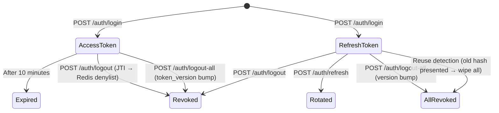
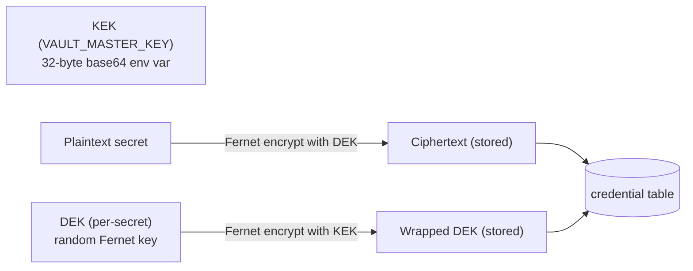

# alphaKey — Architecture

[[services/alphaKey/alphaKey|alphaKey]] · [[services/alphaKey/Interactions|Interactions]] · [[services/alphaKey/API|API]] · [[services/alphaKey/Data|Data]] · [[services/alphaKey/Config|Config]]

---

## Purpose

alphaKey provides identity, authentication, and encrypted credential storage for the platform. It issues short-lived JWT access tokens (ES256, 10min) and opaque refresh tokens (14d), manages a per-user encrypted vault for broker/API credentials, and exposes JWKS and introspection endpoints for offline token verification by other services.

---

## Internal Modules

| Module | Path | Responsibility |
|---|---|---|
| `api` | `alphakey/api/` | FastAPI app, all routers |
| `store` | `alphakey/store/` | SQLModel ORM, 6 tables, Alembic migrations, repos |
| `security` | `alphakey/security/` | JWT (ES256), password hashing (Argon2), vault encryption (Fernet envelope), deps |

---

## Token Lifecycle



---

## Token Security Model

### Access Token (JWT, ES256, 10 minutes)

```json
{
  "iss": "alphakey",
  "aud": "alphakey",
  "sub": "user-uuid",
  "role": "developer",
  "jti": "random-uuid",
  "tv": 3,               // token_version — must match DB; bump = instant invalidation
  "iat": 1717689600,
  "exp": 1717690200,
  "kid": "key-id"        // signing key ID for JWKS lookup (header, not payload)
}
```

**Verification path (offline):** JWKS → find key by `kid` (JWT header) → verify signature → check `exp` / `iss` / `aud` → check Redis denylist (by JTI) → check `tv` matches `user.token_version`

### Refresh Token (opaque, 14 days)

- 96-char hex string (48 random bytes)
- Only SHA-256 hash stored in DB — raw token never persisted
- Rotates on every use: old hash revoked, new record created
- **Reuse detection**: presenting a revoked token → wipe ALL tokens for that user

---

## Vault (Envelope Encryption)



- Each secret has its own DEK — rotating KEK only requires re-wrapping DEKs, not re-encrypting secrets
- `key_version` tracks which KEK version wrapped the DEK (for rotation)
- Plaintext never stored or logged — only returned to authorised service calls

---

## Role System

| Role | Capabilities |
|---|---|
| `developer` | Full access including admin endpoints |
| `admin` | Same as developer (inherits privileges) |
| `standard` | Self-service only: login, vault CRUD, password change |

First registered user automatically gets `developer` role; all subsequent users get `standard`.

---

## Audit Logging

Two append-only audit tables:
- **`audit_log`** — Auth events: login, login_fail, refresh, logout, logout_all, register, role_change, kill_switch, password_change, disable_user, enable_user. Stores actor_user_id, target_user_id, ip, user_agent, detail JSON.
- **`credential_access_audit`** — Every vault read/write/delete. Stores accessor (user_id or `svc:service_name`), user_id, provider, account, name, action, ip.
