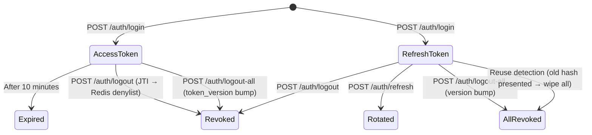
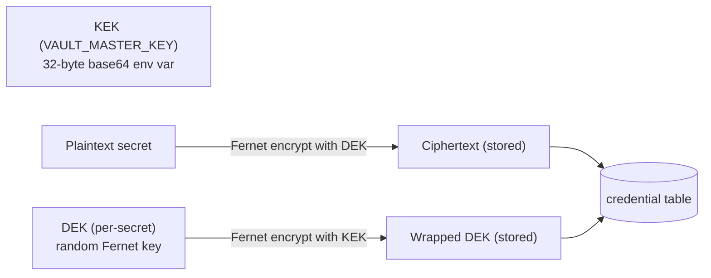

# alphaKey — Architecture

[[alphaKey|alphaKey]] · [[alphaDocs/services/alphaKey/Interactions|Interactions]] · [[alphaDocs/services/alphaKey/API|API]] · [[alphaDocs/services/alphaKey/Data|Data]] · [[alphaDocs/services/alphaKey/Config|Config]]

---

## Purpose

alphaKey provides identity, authentication, and encrypted credential storage for the platform. It issues short-lived JWT access tokens (ES256, 10min) and opaque refresh tokens (14d), manages a per-user encrypted vault for broker/API credentials, and exposes JWKS and introspection endpoints for offline token verification by other services.

---

## Internal Modules

| Module | Path | Responsibility |
|---|---|---|
| `api` | `alphakey/api/` | FastAPI app, all routers |
| `store` | `alphakey/store/` | SQLModel ORM, 6 tables, Alembic migrations, repos |
| `security` | `alphakey/security/` | JWT (ES256), password hashing (Argon2), vault encryption (Fernet envelope), deps |

---

## Token Lifecycle



---

## Token Security Model

### Access Token (JWT, ES256, 10 minutes)

**JWT header** (used for JWKS key lookup — not part of the payload):
```json
{ "alg": "ES256", "typ": "JWT", "kid": "key-id" }
```

**JWT payload:**
```json
{
  "iss": "alphakey",
  "aud": "alphakey",
  "sub": "user-uuid",
  "role": "developer",
  "jti": "random-uuid",
  "tv": 3,
  "sid": "refresh-token-record-uuid",
  "iat": 1717689600,
  "exp": 1717690200
}
```

> `sid` = session ID — the database ID of the linked `RefreshToken` record. Emitted on every login and token refresh. Allows `GET /auth/me/sessions` to identify the current session without re-presenting the opaque refresh token.

> `tv` = token_version — must match `user.token_version` in DB; bump = instant offline invalidation of all tokens for that user.

> `iss` and `aud` default to `alphakey` and are configurable via `JWT_ISSUER` / `JWT_AUDIENCE`. All verifiers (alphaTrade, alphaGen) must be configured with the same values.

**Verification path (offline):** JWKS → find key by `kid` (JWT **header**) → verify ES256 signature → check `exp` / `iss` / `aud` → check Redis denylist by `jti` → check `tv` matches `user.token_version`

---

## JWT Consumer Contract

> [!important] Canonical spec for consumer services
> alphaTrade and alphaGen must implement the verification path below identically. This section is the authoritative reference — do not derive the contract from source code.

### Claim reference

| Location | Claim | Type | Description |
|---|---|---|---|
| **Header** | `kid` | string | Signing key ID — use to select the matching key from JWKS (`GET /auth/.well-known/jwks.json`) |
| Payload | `iss` | string | Issuer — configured via `JWT_ISSUER` (default `alphakey`) |
| Payload | `aud` | string | Audience — configured via `JWT_AUDIENCE` (default `alphakey`) |
| Payload | `sub` | string (UUID) | User ID |
| Payload | `role` | string | `developer` or `standard` |
| Payload | `jti` | string (UUID) | Unique token ID — used for denylist check |
| Payload | `tv` | integer | Token version — must match `user.token_version` |
| Payload | `sid` | string (UUID) | Session ID — DB ID of the linked `RefreshToken` record; present on all tokens issued after 2026-06-14 |
| Payload | `iat` | integer | Issued-at (Unix epoch) |
| Payload | `exp` | integer | Expiry (Unix epoch; access tokens default 10 min) |

### Verification sequence

```
1. Fetch JWKS from GET /auth/.well-known/jwks.json (cache, refresh on unknown kid)
2. Select key where JWKS[n].kid == JWT header.kid
3. Verify ES256 signature
4. Assert exp > now()
5. Assert iss == JWT_ISSUER  (default "alphakey")
6. Assert aud == JWT_AUDIENCE (default "alphakey")
7. Check Redis denylist: key alphakey:deny:{jti} must NOT exist
8. Query user.token_version: must equal JWT payload.tv
```

Steps 7 and 8 require service-to-service access to Redis / the DB (or use `POST /auth/introspect` to delegate all checks to alphaKey). Steps 1–6 are fully offline.

### Refresh Token (opaque, 14 days)

- 96-char hex string (48 random bytes)
- Only SHA-256 hash stored in DB — raw token never persisted
- Rotates on every use: old hash revoked, new record created
- **Reuse detection**: presenting a revoked token → wipe ALL tokens for that user

---

## Vault (Envelope Encryption)



- Each secret has its own DEK — rotating KEK only requires re-wrapping DEKs, not re-encrypting secrets
- `key_version` tracks which KEK version wrapped the DEK (for rotation)
- Plaintext never stored or logged — only returned to authorised service calls

---

## Role System

| Role | Capabilities |
|---|---|
| `developer` | Full access including admin endpoints |
| `admin` | Same as developer (inherits privileges) |
| `standard` | Self-service only: login, vault CRUD, password change |

First registered user automatically gets `developer` role; all subsequent users get `standard`.

---

## Audit Logging

Two append-only audit tables:
- **`audit_log`** — Auth events: login, login_fail, refresh, logout, logout_all, register, role_change, kill_switch, password_change, disable_user, enable_user. Stores actor_user_id, target_user_id, ip, user_agent, detail JSON.
- **`credential_access_audit`** — Every vault read/write/delete. Stores accessor (user_id or `svc:service_name`), user_id, provider, account, name, action, ip.
