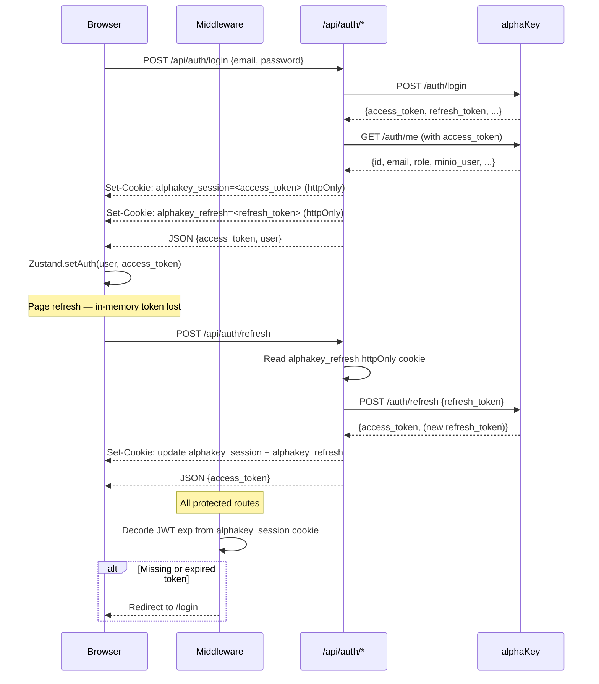

# alphaLink — Architecture

[[services/alphaLink/alphaLink|alphaLink]] · [[services/alphaLink/Interactions|Interactions]] · [[services/alphaLink/API|API]] · [[services/alphaLink/Data|Data]] · [[services/alphaLink/Config|Config]]

---

## Purpose

alphaLink is the unified frontend for the entire alphaPlatform. It provides:
1. **Pages** — React UI for training models, monitoring live trading, backtesting, account management
2. **BFF routes** (`/app/api/*`) — server-side proxies that hide backend service URLs, inject auth, and normalise responses

---

## App Pages (`src/app/`)

| Route | Purpose |
|---|---|
| `/` | Redirects to `/trade/dashboard` |
| `/login` | Email/password login → POST `/api/auth/login` — includes TOTP step-up when MFA enrolled; 429 responses show lockout message |
| `/signup` | Registration → POST `/api/auth/register` |
| `/forgot-password` | Password reset request — public route |
| `/reset-password` | Password reset confirmation (reads `?token=`) — public route |
| `/account` | User account: VaultSection, MfaSection (TOTP enrollment/disable), SessionsSection (active sessions + revoke) |
| `/trade/admin/users` | Admin-only user management — enable/disable/force-logout/role-change via alphaKey admin routes |
| `/trade/dashboard` | Main trading dashboard — positions, orders, equity curve |
| `/trade/models/published` | Published models from alphaGen |
| `/trade/models/registry` | MLflow model registry view |
| `/trade/models/public` | Public model library |
| `/trade/backtest` | Backtest runner + results |
| `/trade/jobs` | Background job log — paginated backtest run history with per-model drill-down |
| `/trade/train/configure` | Model training config builder |
| `/trade/train/runs` | Training job list |
| `/trade/train/results` | Individual run results |
| `/trade/train/compare` | Side-by-side run comparison |
| `/trade/train/templates` | Saved config templates |
| `/trade/train/jobs` | Training job management |
| `/trade/equity` | Equity curve chart |
| `/trade/orders` | Order history |
| `/trade/positions` | Open positions |
| `/trade/pnl` | P&L by day |
| `/trade/signals` | Signal history |
| `/trade/trades` | Closed trade journal |
| `/results/[jobId]` | Individual training run result |
| `/runs` | All training runs list |
| `/templates` | Global template management |
| `/configure` | Platform configuration |
| `/compare` | Run comparison (standalone) |

---

## BFF Pattern

All browser-to-backend communication goes through Next.js API routes (`/app/api/*`):

```
Browser → /api/auth/* → alphaKey
Browser → /api/jobs/* → alphaGen
Browser → /api/trade/* → alphaTrade
Browser → /api/config/* → alphaGen
Browser → /api/templates/* → ~/.alphalink/templates/ (filesystem)
Browser → /api/instruments?q= → local search
Browser → /api/polygon-key → alphaKey vault (polygon/default/api_key)
Browser → /api/fs/browse → local filesystem (restricted to $HOME / FS_BROWSE_ROOT)
```

**Benefits:**
- Backend service URLs never exposed to browser
- `Authorization: Bearer <token>` injected server-side
- `refresh_token` stored in httpOnly cookie — never accessible to JavaScript
- Response normalisation (e.g. alphaGen run → frontend Job type)

---

## State Management

### Auth Store (Zustand, in-memory only)

```typescript
// src/lib/auth-store.ts
interface AuthState {
  user: { name, email, role, minio_user, minio_account } | null
  role: string
  status: 'unauthenticated' | 'authenticated' | 'loading'
  accessToken: string | null   // Never persisted to localStorage
}
```

- `accessToken` only in-memory — lost on page refresh → `AuthInitializer` restores via `POST /api/auth/refresh` (reads httpOnly cookie)
- `user` persisted to localStorage (non-sensitive identity data)
- `status: 'loading'` while `AuthInitializer` is restoring session — components must not treat this as unauthenticated

**Exported helpers (`src/lib/auth-store.ts`):**

```typescript
decodeTokenExp(token: string): number | null
// Parses exp claim from JWT payload (base64url-decoded JSON). Returns epoch seconds or null.

refreshAccessToken(): Promise<string | null>
// Calls POST /api/auth/refresh, updates store on success.
// 401/403 → clearAuth(). 5xx/network error → leaves auth intact (service may be temporarily down).
// Returns new access_token or null.
```

### Session Config Store (Zustand, localStorage)

```typescript
// src/lib/store.ts (name: "alphagen.session")
interface SessionConfig {
  run_name, tickers, interval, startDate, endDate, provider,
  labelStrategy, features, modelArch, trainParams, backtestConfig, ...
}
```

- Preserved across page navigation
- `PRESERVED_KEYS`: tickers, startDate, endDate, provider (not reset when changing steps)
- Used by config builder pages and `config-to-yaml.ts` to generate `RunConfig` YAML

### React Query

Server data (positions, orders, runs, models) fetched and cached via React Query — auto-invalidation on mutations.

---

## Authentication Flow



### Proactive Token Refresh

`AuthInitializer` (`src/lib/auth-provider.tsx`) schedules a silent refresh before the access token expires:

1. On every `accessToken` change, decode `exp` from JWT payload via `decodeTokenExp`
2. Schedule `setTimeout` at `exp - 60s` (fires 60 seconds before expiry)
3. Timer calls `refreshAccessToken()` — on success, store updates with new token → effect re-runs → new timer scheduled (self-rescheduling)
4. If refresh fails, redirect to `/login?next=<current-path>&reason=session_expired`

The `/login` page renders an amber banner when `reason=session_expired` is present in the query string.

### Retry-on-401

Both `tradeFetch` (`src/lib/trade-fetch.ts`) and `authFetch` (`src/lib/auth-fetch.ts`) implement retry-on-401:

1. Make request with current `accessToken`
2. On 401: call `refreshAccessToken()`
3. On success: retry request once with new token
4. If retry also returns 401 (or refresh returned null): hard redirect to `/login?next=<path>&reason=session_expired`

This covers the gap where a token expires between page load and the user triggering an action.

---

## Key Components

| Category | Key Components |
|---|---|
| **Layout** | `Navigation`, `ThemeProvider`, root layout |
| **Auth** | `AuthInitializer` — restores token on mount via refresh; schedules proactive silent refresh at `exp-60s`; redirects to `/login?reason=session_expired` on failure |
| **Config builder** | Multi-step form (Data → Model → Train) using SessionConfig store |
| **Trade UI** | `SSEProvider` (manages live events from alphaTrade `/stream`), position/order/signal tables |
| **Charts** | Backtest equity curve (Recharts), candlestick (lightweight-charts) |
| **Account** | `VaultSection` — encrypted credential storage UI (T212, Polygon, SMTP, Slack). `MfaSection` — TOTP enrollment/disable (setup → QR → verify). `SessionsSection` — active session list with per-session revoke. MinIO credentials are infra-provisioned and not user-editable. |
| **Admin** | `/trade/admin/users` — admin-gated user table; enable/disable (bumps token_version → immediate platform-wide logout), force-logout, role change. |
| **Models** | Registry page: multi-select checkboxes + bulk delete bar. Override drawer: consensus gate inputs (`consensus_min_confidence`, `consensus_min_margin`) with HOLD coercion docs. |
| **Models** | Registry browser, model detail, promote/demote actions |
| **UI primitives** | shadcn/ui — Card, Input, Button, Dialog, Tabs, Select, Toast (Sonner) |

---

## Key Design Decisions

- **BFF proxies everything**: No direct browser-to-backend calls. Allows service URL changes without frontend deploys.
- **Access token in-memory only**: Prevents XSS token theft. Refresh token in httpOnly cookie prevents JS access.
- **Middleware JWT guard**: All routes except `/login`, `/signup`, `/forgot-password`, `/reset-password`, `/api/auth/*` require `alphakey_session` cookie containing a valid, non-expired access token. Middleware decodes the JWT `exp` claim — a forged or absent cookie is rejected before the request reaches any BFF route.
- **BFF token forwarding**: `src/lib/server-auth.ts` (`getSessionToken`) reads `alphakey_session` server-side; BFF routes use `bearerHeader(token)` to forward `Authorization: Bearer` to alphaGen and alphaKey. Client requests to `/api/jobs/*` and `/api/runs` no longer need to supply the header themselves.
- **Proactive JWT refresh**: Timer scheduled at `exp - 60s` silently refreshes the access token before it expires. Self-rescheduling via `[accessToken]` useEffect dependency. Avoids mid-session 401s for active users.
- **Retry-on-401**: All authenticated client-side fetches (`tradeFetch`, vault `authFetch`) attempt one silent token refresh on 401 before redirecting. Covers the window between page load and user action where the token may have expired.
- **Session-expired redirect**: On unrecoverable 401, redirect to `/login?next=<path>&reason=session_expired`. Login page shows an amber "session expired" banner when this param is present.
- **5xx / network errors leave auth intact**: `refreshAccessToken` only calls `clearAuth()` on 401/403. Transient upstream failures do not force the user to re-login.
- **MinIO credentials are infra-only**: `minio_user` / `minio_account` are provisioned at registration on the `AuthUser` profile. They are not user-managed vault entries and do not appear in the vault UI.
- **`att` CLI binary**: `ATT_BIN` env var points to local `att` binary for `att validate --json` (config validation before submit).
- **Standalone Next.js output**: `output: "standalone"` in `next.config.mjs` for Docker image minimisation.
