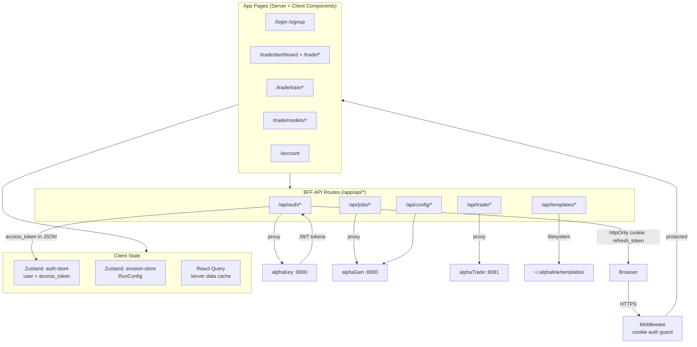

# alphaLink

> Frontend UI and BFF (Backend for Frontend) — Next.js app that provides the trading platform dashboard and proxies all browser requests to backend services.

**Status:** 🟢 Full  
**Port:** `3000`  
**Repo path:** `projectAlpha/alphaLink/`

---

## Contents

| Page | Description |
|---|---|
| [[services/alphaLink/Architecture\|Architecture]] | App structure, BFF pattern, state management |
| [[services/alphaLink/Interactions\|Interactions]] | All inputs/outputs, proxied services |
| [[services/alphaLink/API\|API]] | All BFF route handlers (`/app/api/*`) + outbound calls |
| [[services/alphaLink/Data\|Data]] | No DB — local template/artifact filesystem storage |
| [[services/alphaLink/Config\|Config]] | Env vars, auth flow, session config |

---

## Mermaid Flow

---

## Related

- [[platform/Overview]] — system-wide context
- [[services/alphaGen/alphaGen|alphaGen]] — training API backend
- [[services/alphaTrade/alphaTrade|alphaTrade]] — trading API backend
- [[services/alphaKey/alphaKey|alphaKey]] — auth backend
- [[reference/Glossary]] — BFF, SSE
