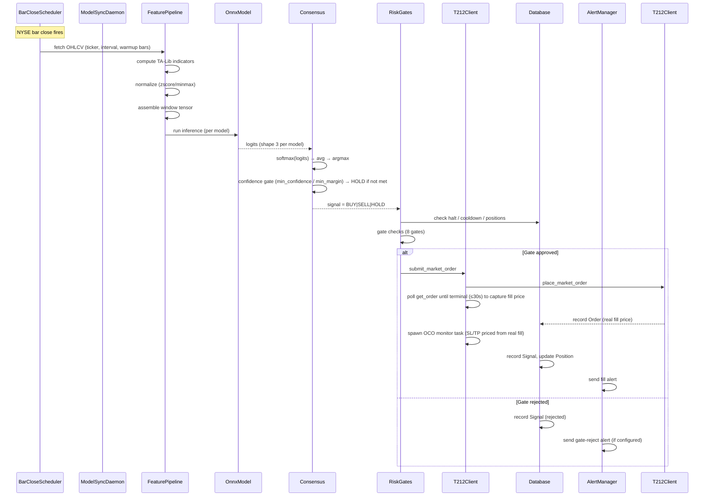
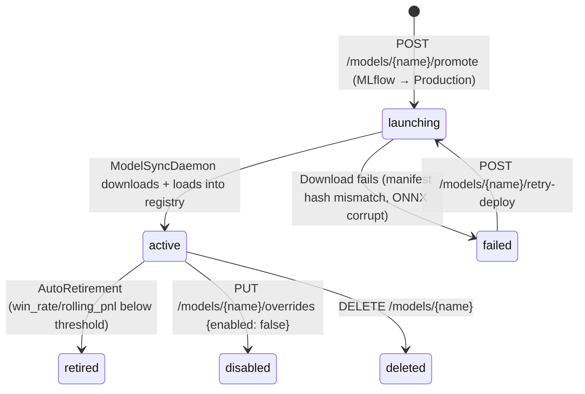

# alphaTrade — Architecture

[[services/alphaTrade/alphaTrade|alphaTrade]] · [[services/alphaTrade/Interactions|Interactions]] · [[services/alphaTrade/API|API]] · [[services/alphaTrade/Data|Data]] · [[services/alphaTrade/Config|Config]]

---

## Purpose

alphaTrade is the live trading executor. It continuously polls for new ONNX models, runs inference at each bar close (NYSE-calendar aware), fuses signals from multiple models via softmax consensus, applies risk gates, and submits market + OCO bracket orders to Trading 212.

---

## Internal Modules

| Module | Path | Responsibility |
|---|---|---|
| `api` | `alphaTrade/api/` | FastAPI app, 40+ routers, SSE event bus, auth middleware |
| `broker` | `alphaTrade/broker/` | T212Client, order submission, OCO monitor, instrument map |
| `scheduler` | `alphaTrade/scheduler/` | NYSE bar-close scheduler + APScheduler backtest cron |
| `risk` | `alphaTrade/risk/` | Risk gates, position sizing (fixed/ATR/VIX), retirement, sector limits |
| `consensus` | `alphaTrade/consensus/` | Softmax-averaged multi-model signal fusion |
| `store` | `alphaTrade/store/` | SQLModel ORM, Alembic migrations (0026), repos |
| `backtest` | `alphaTrade/backtest/` | Bar-by-bar simulation engine + reporter |
| `notify` | `alphaTrade/notify/` | Slack/Email/Webhook alerts with rate limiting |
| `data` | `alphaTrade/data/` | OHLCV provider abstraction (yfinance / Polygon) |
| `security` | `alphaTrade/security/` | API key auth, T212 credential management, Fernet at-rest encryption for DB secret columns |
| `cache` | `alphaTrade/cache/` | VIX caching, sector caching |
| `adapter` | `alphaTrade/adapter/` | Model loading, ONNX runtime, manifest parsing |

---

## Scheduler Tick Sequence

The core trading loop executes at each NYSE bar close:

---

## Model Lifecycle in alphaTrade

---

## Risk Gate Sequence (8 checks)

Applied in order before any order:

1. **Daily loss halt** — if daily PnL ≤ `daily_loss_halt_pct` and signal ≠ HOLD → REJECT
2. **HOLD signal** — no order
3. **Model retirement check** — if `model_performance.retired=true` → REJECT
4. **Cooldown check** — if `position.cooldown_until_ts > now` → REJECT
5. **Sector gate (BUY)** — portfolio mode balanced/unbalanced sector limit → REJECT if cap breached
6. **Max positions cap (BUY)** — if open_count ≥ `max_positions` → REJECT
7. **Pyramiding gate (BUY)** — `safe_mode=true` + existing position → REJECT; intraday intervals block pyramid unless `dangerously_allow_pyramid=true`
8. **Short-sell prevention (SELL)** — no existing long position → REJECT

---

## OCO Monitor (per-position async task)

After a BUY order fills, a dedicated async task polls both bracket legs every 10s:
- T212 `get_order` / `cancel_order` calls run via `asyncio.to_thread` — prevents event loop stalls on slow/429 T212 polls
- On SL fill → cancel TP leg (via `to_thread`), record `TradeJournal (exit_reason=OCO_SL)`, check retirement, set cooldown
- On TP fill → cancel SL leg (via `to_thread`), record `TradeJournal (exit_reason=OCO_TP)`, check retirement, set cooldown
- On non-fill terminal (CANCELLED/REJECTED) → cancel other leg, send warning webhook
- **On SELL signal fill**: cancels the OCO monitor task AND cancels both active broker legs before removing the position — prevents orphaned SL/TP orders from executing against a closed position

---

## Model Auto-Retirement

`risk.performance.check_retirement()` runs after each trade record:
- Evaluates: `rolling_win_rate < min_win_rate` AND `rolling_pnl < min_rolling_pnl`
- Both age gates must pass: `trade_count >= min_trades_before_evaluation` AND age ≥ `min_evaluation_period`
- Sets `model_performance.retired=true` — model excluded from future ticks but NOT deleted

---

## Key Design Decisions

- **DB-first overrides**: YAML seeds Settings at startup; DB values overwrite on each tick/API update — enables hot-reload without restart. See [[services/alphaTrade/Config]] for full chain.
- **ONNX Runtime only**: No PyTorch dependency in alphaTrade. Manifest provides everything needed for inference.
- **Softmax consensus with confidence gates**: Multi-model averaging prevents single-model noise. Optional `consensus_min_confidence` (absolute probability threshold) and `consensus_min_margin` (lead over runner-up) gates coerce low-conviction signals to HOLD before they reach the risk pipeline.
- **Fill price polling**: After `place_market_order`, AsyncBroker polls `get_order` up to 30s at 1s intervals to capture the real fill price. OCO SL/TP prices and journal PnL are computed from the confirmed fill, not the signal-time price.
- **Secrets at rest encrypted**: `BotSettings` secret columns (API keys, SMTP password, Slack webhook) are encrypted with Fernet symmetric encryption when `DB_SECRETS_KEY` is set. Reads are transparently decrypted; plaintext rows written before encryption was enabled are returned as-is (migration-safe fallback). For production, `SECRETS_SOURCE=alphakey` is required (see COMPLIANCE.md).
- **model.ready dual-path sync**: `ModelSyncDaemon` subscribes to the Redis `model.ready` channel alongside its periodic MLflow poll. Payload `{run_name, version, published_at, artifact_prefix?}`. If `artifact_prefix` present (explicit `POST /runs/{id}/publish`) → download artifacts directly from MinIO at that prefix. If absent (Celery auto-promote via MLflow) → trigger `_sync_once()` immediately instead of waiting for the next poll interval.
- **JWT iss/aud validation**: `verify_token()` validates `iss` and `aud` claims against `JWT_ISSUER` / `JWT_AUDIENCE` env vars (default `alphakey`). Tokens with wrong or missing iss/aud are rejected. Configurable for multi-tenant deployments.
- **Registry refresh throttled**: `ModelRegistry.refresh()` (disk scan) and DB override reads run at most once per 60s across all interval tick functions, not once per tick per interval.
- **Kill switch = HALT file**: Inference continues; only order submission is blocked. Allows diagnosis without losing market state.
- **Health on separate port 8080**: Container probe (`GET /healthz`) decoupled from API auth on 8081.
- **SELL quantity = held position qty**: SELL orders use `position.quantity`, not `compute_quantity()`, preventing oversell and partial-close journaling errors.
- **Auth fail-closed**: No `alphaTrade_API_KEY` + no `ALPHATRADE_INSECURE_NO_AUTH=true` → 401. The old open-by-default behaviour required explicit opt-in to insecure dev mode.
- **T212Client HTTP pooling**: `T212Client` owns a single `httpx.Client` instance; all `_get`/`_post`/`_delete` reuse it. Eliminates TCP+TLS handshake per OCO poll (2 calls/10s/position). Call `client.close()` or use as context manager to release. Module-level `httpx.get/post/delete` functions removed.
- **get_total_equity fail-closed**: Raises `ValueError` (not returns 0) when `totalValue` absent from account summary. Callers must skip the tick — trading on cash-only equity would exclude position value and mis-size orders.
- **Calendar scheduling fail-loud**: `bar_close._next_daily_bar_close` / `_next_weekly_bar_close` log `ERROR` on `exchange_calendars` failure before falling back to UTC-midnight arithmetic. Silent fallback previously masked misconfigured environments where daily bars fired at midnight instead of 4 pm ET.
