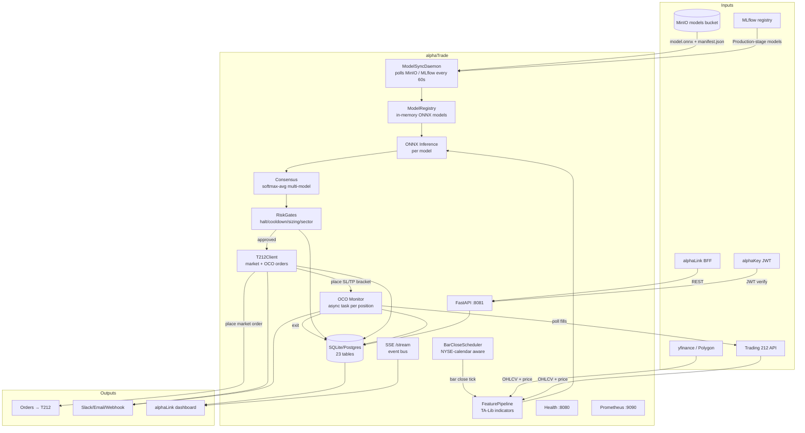

# alphaTrade

> Live trading executor — loads ONNX models published by [[services/alphaGen/alphaGen|alphaGen]], runs inference on bar-close, applies risk gates, and submits orders to Trading 212.

**Status:** 🟢 Full  
**Ports:** `8081` (REST API), `8080` (health probe), `9090` (Prometheus metrics)  
**Repo path:** `projectAlpha/alphaTrade/`

---

## Contents

| Page | Description |
|---|---|
| [[services/alphaTrade/Architecture\|Architecture]] | Internal modules, model lifecycle, scheduler tick |
| [[services/alphaTrade/Interactions\|Interactions]] | All inputs/outputs, upstream/downstream |
| [[services/alphaTrade/API\|API]] | 40+ endpoints + SSE stream + outbound calls |
| [[services/alphaTrade/Data\|Data]] | 23 DB tables, read/write counts, MinIO, Redis |
| [[services/alphaTrade/Config\|Config]] | Env vars, overrides.yaml, DB-first override chain |

---

## Mermaid Flow

---

## Related

- [[platform/Overview]] — system-wide context
- [[services/alphaFrame/alphaFrame|alphaFrame]] — provides Postgres, Redis, MinIO, MLflow
- [[services/alphaGen/alphaGen|alphaGen]] — produces model artifacts consumed here
- [[services/alphaLink/alphaLink|alphaLink]] — primary REST caller + SSE consumer
- [[services/alphaKey/alphaKey|alphaKey]] — JWT verification
- [[reference/Glossary]] — OCO, consensus, gate, manifest, override
- [[reference/Event-Channels]] — model.ready, SSE /stream
